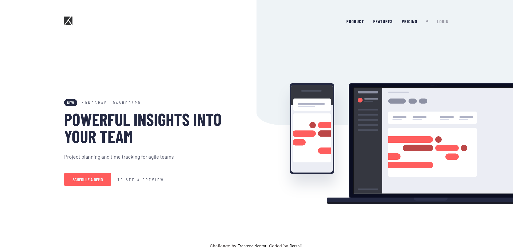

# Frontend Mentor - Project tracking intro component solution

## Overview

### The challenge

Users should be able to:

- View the optimal layout for the site depending on their device's screen size
- See hover states for all interactive elements on the page
- Create the background shape using code

### Screenshot

### Links

- Solution URL: [Github Repo](https://github.com/darshii98/project-track-component)
- Live Site URL: [Github Pages](https://darshii98.github.io/project-track-component/)

### Built with

- Semantic HTML5 markup
- CSS custom properties
- Flexbox

## Author

- Github- [darshii98](https://github.com/darshii98/)
- Frontend Mentor - [@darshii98](https://www.frontendmentor.io/profile/darshii98)
